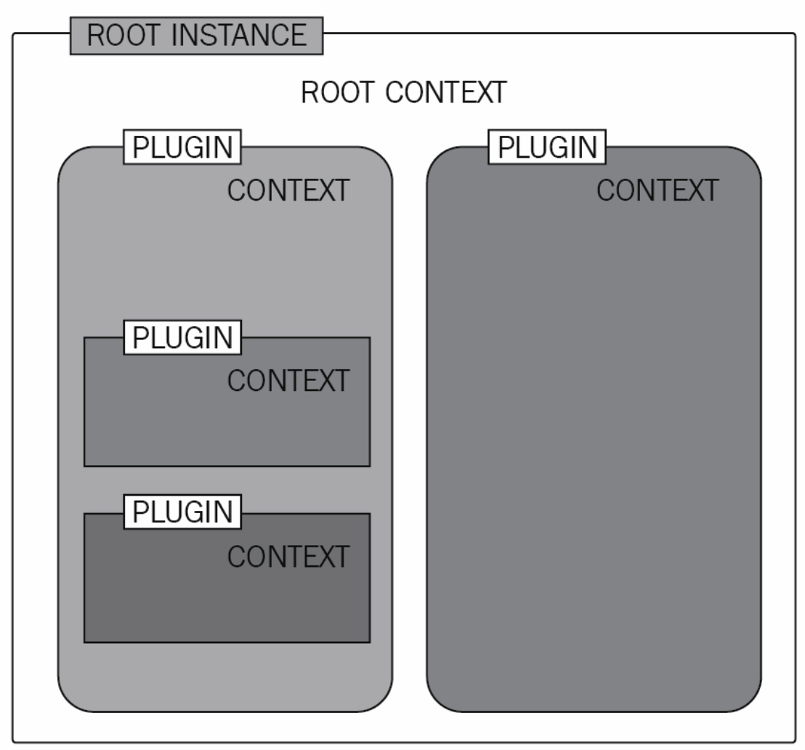

# Node Fastify Architecture

A boilerplate/starter project for quickly building RESTful APIs using Node.js, Fastify, and Prisma.

This repository contains a Node.js Fastify application that follows a modular architecture. Each business entity is wrapped inside a single module, including routes, controllers, services, and other related components.

> ⚡️ The project is setup to work with node v20, which is gonna be next LTS from 24th October 2023.
> Node v20 includes native test runner. The project is setup to use the same and doesn't depend on external libraries like jest, mocha, ava etc. for tests.
> Node v20 also allows to use `await` outside `async` and the project also uses this feature

## The project

The project is organized with a modular architecture to promote separation of concerns and code reusability. The architecture is designed to keep services separate from controllers, enabling better data processing and more maintainable code.

```
root
├── prisma/
│   ├── [Prisma data handling files]
└── src/
    ├── server.js
    ├── app.js
    ├── plugins/
    │   ├── [Plugin files]
    ├── utils/
    │   ├── [Utility files]
    ├── modules/
    │   ├── auth/
    │   │   ├── auth.module.js
    │   │   ├── auth.routes.js
    │   │   ├── auth.service.js
    │   │   ├── auth.controller.js
    │   │   └── auth.schema.js
    │   ├── health/
    │   │   ├── health.module.js
    │   │   ├── health.routes.js
    │   │   ├── health.service.js
    │   │   ├── health.controller.js
    │   │   └── health.schema.js
    └── [Other module directories and files]
```

- The project root directory contains two main directories: prisma for data handling (e.g., database schema) and src for the application source code.

- `src` directory contains several files and directories:

  `server.js:` This file is responsible for building the Fastify app and passing the configuration to app.js.

  `app.js:` This file registers all the plugins, decorators, and modules for the Fastify app.

  `plugins/:` This directory contains Fastify plugins used in the application.

  `middlewares/:` This directory contains middleware files used for request processing.

  `utils/:` This directory contains utility files with common functions or helpers.

  `modules/:` This directory contains separate modules for different business entities.

  - Each module (e.g., auth, health) in the modules/ directory has the following files:

    `auth.module.js:` This file represents the module and may contain module-specific configurations or setups.

    `auth.routes.js:` This file contains the route definitions and handlers for the module's routes.

    `auth.service.js:` This file holds the business logic and data processing for the module.

    `auth.controller.js:` This file serves as the controller, handling incoming requests and calling services.

    `auth.schema.js:` This file defines the data schema or models for the module.

This project structure organizes the application into separate modules, allowing each module to have its own routes, services, and controllers. The modules promote code modularity, reusability, and separation of concerns, making the codebase more maintainable and scalable.

## Why Separate Services and Controllers?

The decision to separate services from controllers is motivated by several factors:

**Modularity:** By organizing each business entity as a separate module, the code becomes more modular and easier to manage.

**Reusability:** Separating services allows them to be reused across multiple controllers, promoting code reusability.

**Data Processing:** Services can handle complex data processing tasks and interact with multiple services, combining and processing data before sending back responses to clients.

**Testability:** The separation of concerns makes it easier to write unit tests and mock dependencies for testing services and controllers independently.

## Steps to Run

1. install node v20 `nvm install v20.5.0`
2. use node v20 `nvm use 20`
3. install pnpm `npm i -g pnpm`
4. install dependencies `pnpm install`
5. setup Prism `pnpm dlx prisma generate`
6. run the app `pnpm start`; _it will run the app in development_
7. run the unit tests `pnpm test` _it uses node.js v20 native test runner_

The application contains below routes:

```
└── /
    ├── fastify-overview-ui/ (don't forget to add the slash)
    │   └── * (HEAD, GET)
    ├── json-overview-ui (GET, HEAD)
    └── api/v1/auth/login (POST)
    └── health
```

`your-host:port/fastify-overview-ui/`: gives you a nice UI which visualizes everything your has application has like plugins, hooks, decorators etc.

`your-host:port/json-overview-ui`: gives json version of everything your has application has like plugins, hooks, decorators etc.

`your-host:port/api/v1/auth/login`: an api to play around with the features: decorators, context, plugins, routes, schema-validation etc.

# Everything you need to get started with Fastify

Fastify! or should I call it _Pluginify_? 😛

Philosophy:

- Plugin design system
- DRY (Don't repeat yourself)
- Immutability
- Divide & Conquer

### Fastify’s main components

- **root application instance:** controls the standard Node.js `http.Server`` class and sets all the endpoints and the default behavior for every request and response.
- **a plugin instance:** a child object of the application instance, which shares the same interface. It isolates itself from other sibling plugins to let you build independent components that can’t modify other contexts.
- **request:** a wrapper of the standard Node.js http.IncomingMessage that is created for every client’s call.
- **reply:** a wrapper of the standard Node.js http.ServerResponse and facilitates sending a response back to the user

### Utility components

- **hook:** a functions that act, when needed, during the lifecycle of the application or a single
  request and response
- **decorator:** let you augment the features installed by default on the main components, avoiding code duplication
- **parser:** responsible for the request’s payload conversion to a primitive type

## Creating the server

You create a new fastify instance first, this will represent the root application, the root in context tree structure.

```js
const serverOptions = {
    logger: {
      level: 'info',
    },
    genReqId: () => crypto.randomUUID(),
  },
const app = Fastify(serverOptions);
```

The created fastify instance `app` has many useful properties and methods,

### Instance properties

```js
// get the application initial configs
app.log.debug(app.initialConfig, 'Fastify listening with the config');

// get details about the server address
const { port } = app.server.address();
app.log.info('HTTP Server port is %i', port);
```

### Instance methods

```js
// adds a new endpoint to the server
app.route(options[, handler])

// adds plugins to the server instance, creating a new server context if needed. This method provides Fastify with encapsulation
app.register(plugin)

// loads all the applications without listening for the HTTP request
app.ready([callback])

// starts the server and loads the application
app.listen(port|options [,host, callback])

// turns off the server and starts the closing flow. This generates the possibility to close all the pending connections to a database or to complete running tasks.
app.close([callback])
```

## Adding your first route

```js
app.route({
  url: '/hello',
  method: 'GET',
  handler: function myHandler(request, reply) {
    reply.send('world');
  },
});

const cats = [];
app.post('/cat', function saveCat(request, reply) {
  cats.push(request.body);
  reply.code(201).send({ allCats: cats });
});
```

OR use a shorthand,

```js
app.get('/hello', function myHandler(request, reply) {
  reply.send('world');
});
```

We can make it even shorter using an arrow function,

```js
app.get('/hello', (request, reply) => reply.send('world'));
```

🛑 Stop!

> Using an arrow function will prevent you from getting the function context. Without the context, you don’t have the possibility to use the this keyword to access the application instance. The arrow function syntax may not be a good choice because it can cause you to lose a great non-functional feature:the **_source code organization_**!

🎩 **Context Tip: Use named function and avoid using arrow functions!**

_It would be best to choose named functions._ In fact, avoiding arrow function handlers will help you debug your application and split the code into smaller files without carrying boring stuff, such as the application instance and logging objects. This will let you write shorter code and make it faster to implement new endpoints. The context binding doesn’t work exclusively on handlers but also works on every Fastify input function and hook, for example!

**_This is the reason the repository is structured to use named function and avoids the arrow function usage._**

When you use named functions, you can the logger using this keyword and other app context:

```js
// register the config at app level
app.decorate('config', { APP_CONFIG: 'some_app_config' })

app.get('/hi', function multi(request, reply) {
  this.log.info('this line is executed') 😱
  this.log.info(this.config.APP_CONFIG) 😱
  reply.send('bye')
})
```

### Few words on using the handler

#### Sync Handler

- use named function
- don't use multiple `reply.send()` if you need to use in case of conditions i.e if/else, use `return reply.send()`
- you can also just only return from the handler and fastify take care of everything `return data;`

#### Async Handler

- avoid using `reply.send()`, just return the value `return data;`. If you need to have different status code,

  ```js
  app.get('/hi', async function multi(request, reply) {
    reply.code(203);
    return { msg: 'bye' };
  });
  ```

  One more advantage of not using `reply.send()` is that, you can use the same handler in other handler as well.

  ```js
    sync function foo (request, reply) {
      return { one: 1 }
    }
    async function bar (request, reply) {
      const oneResponse = await foo(request, reply)
      return {
        one: oneResponse,
        two: 2
      }
    }

  // use case
  app.get('/foo', foo)
  app.get('/bar', bar)
  ```

- _If you only want to return a promise and don't want to use `await` inside the handler, use the `sync handler`; fastify will take care of resolving the promise._

```js
const fs = require('fs/promises');
app.get('/file', function promiseHandler(request, reply) {
  const fileName = './package.json';
  const readPromise = fs.readFile(fileName, { encoding: 'utf8' });
  return readPromise;
});
```

### Request Component

- `request.query` returns a key-value JSON object with all the query-string input parameters.
- `request.params` maps the URL path parameters to a JSON object.
- `request.headers` maps the request’s headers to a JSON object as well.
- `request.body` returns the request’s body payload. It will be a JSON object if the request’s Content-Type header is application/json. If its value is text/plain, the body value will be a string. In other cases, you will need to create a parser to read the request payload accordingly.

### Reply Component

- `reply.send(payload)` will send the response payload to the client. The payload can be a String, a JSON object, a Buffer, a Stream, or an Error object. It can be replaced by returning the response’s body in the handler’s function.
- `reply.code(number)` will set the response status code.
- `reply.header(key, value)` will add a response header.
- `reply.type(string)` is a shorthand to define the Content-Type header.

## Adding your first plugin

Plugin instance is a child component of an application instance.

plugins are the basic building blocks of our application. Some of the most prominent properties are the following:

• A plugin can register other plugins inside it.

• A plugin creates, by default, a new scope that inherits from the parent. This behavior also applies to its children and so on, although using the parent’s context is still possible.

• A plugin can receive an options parameter that can be used to control its behavior, construction, and reusability.

• A plugin can define scoped and prefixed routes, making it the perfect router.

_At this point, it should be clear that where other frameworks have different entities, such as middleware, routers, and plugins, Fastify has only **plugins**!._

```js
app.register(
  function myPlugin(pluginInstance, opts, next) {
    pluginInstance.log.info('I am a plugin instance, children of app');
    next();
  },
  { hello: 'the opts object' }
);
```

🛑 **_Stop here! First of all go through [this](https://www.nearform.com/blog/complete-guide-fastify-plugin-system/) article to understand plugin and their contexts_**

These simple lines have just created an encapsulated context: this means that every event, hook, plugin, and decorator registered in the myPlugin scope function will remain inside that context and all its children. Optionally, you can provide an input object as a second parameter to the register function. This will propagate the input to the plugin’s opts parameter. If you move the plugin to another file, this will become extremely useful when sharing a configuration through files.

Fastify creates a new context every time it enters a new plugin. We call these new contexts child contexts. A child context inherits only from the parent contexts, and everything added inside a child context will not be visible to its parent or its siblings’ contexts. The parent-child annidation level is infinite, and we can have contexts that are children to their parents and parents to their children.
The entities that are affected by scoping are:

• Decorators

• Hooks

• Plugins

• Routes



### Handling the Context

_By default we can only access/read the data from Parent context when we need it in child context.
But we can't share context between siblings or alter a parent context. This is default Fastify behaviour_

But we need it, we still can do it using `fastify-plugin` package. This comes in handy for more complex plugins, such as ones that handle database connections.

```js
// myplugin.js
const fp = require('fastify-plugin');
async function myPlugin(fastify, _options) {
  console.log('myPlugin decorates the parent instance.');
  fastify.decorate('myPlugin', 'hello from myPlugin.');
}
module.exports = fp(myPlugin, {
  name: 'myPlugin',
  fastify: '4.x',
  decorators: { fastify: ['root'] },
});

// index.js
const Fastify = require('fastify');
const myPlugin = require('./fp-myplugin.cjs');
const app = Fastify({ logger: true });
app.decorate('root', 'hello from the root instance.');
app.register(myPlugin);
app.ready().then(() => {
  console.log('root -- ', app.root);
  console.log('root -- ', app.myPlugin);
});
```

_The context of child when wrapped with `fp` gets merged into the parent._

# Questions

*Feel free to add yours!*

- When to prefer `fastify.decorateRequest()` over `fastify.decorate()`? https://github.com/fastify/help/issues/918
- Should we install the dependencies which fastify already has like pino, ajv If we want to customize default behaviour? https://github.com/fastify/help/issues/917
- Clarification on the Impact of Awaiting a Plugin/Decorator https://github.com/fastify/help/issues/919  
# Learning Materials

https://www.youtube.com/watch?v=gltzZjKYK1I

https://www.youtube.com/watch?v=ucatti2b7E4&list=PLAv2aQ9JgGbVAGY0ht6JMoGJ8tF_MJ4fx

https://www.youtube.com/watch?v=g-6Ig8k6Nzc&pp=ygUOZmFzdGlmeSBzaGFwZXM%3D

https://www.youtube.com/watch?v=e0rdy7APH-o

https://www.youtube.com/watch?v=-X84Cq-nsLw

https://www.youtube.com/watch?v=e1jkA-ee_aY&t=1s&pp=ygUOZmFzdGlmeSBzaGFwZXM%3D
